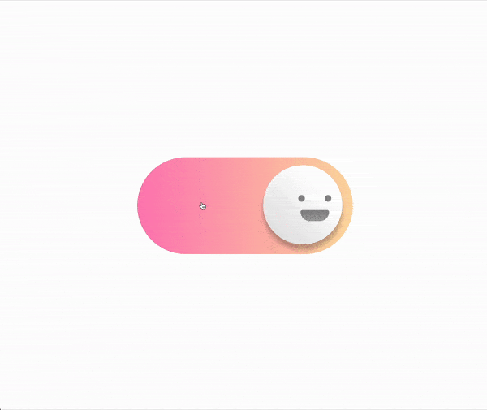

# 😊 Toggle Face

This project features a toggle switch with a face that changes expression when toggled, showcasing intricate CSS animations and transitions.

## 📦 Technologies

Built with:

- `HTML:` Markup language for creating the structure.
- `CSS:` For styling and animations.

## ⚙️ Getting Started

To view and interact with the Toggle Face animation:

1. Download the project files.
2. Open the `index.html` file in Visual Studio Code.
3. Use the Live Server extension in VS Code to view the project in your web browser.

## 🖱️ Interaction

Toggle the switch to see the face change its expression and background color animate smoothly.

## 🛣️ Project Structure

Here are the key files and their purposes:

- **index.html**: The main HTML file containing the structure of the Toggle Face animation.
- **style.css**: The CSS file that styles the toggle switch and adds animations.

Feel free to explore and customize these files to suit your needs!

## 📱 Responsive Design

- The Toggle Face animation is responsive, ensuring a seamless experience on both desktops and mobile devices.

## 🔄 Animations

The Toggle Face animation includes various CSS animations and transitions. Here’s an overview:

- **Face Movement**: The face moves smoothly from one side to the other when toggled.
- **Expression Change**: The eyes and mouth change to create different facial expressions.
- **Background Transition**: The background color transitions smoothly when toggled.
